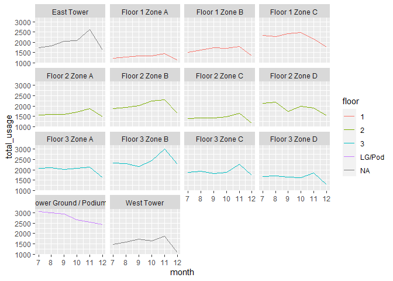

process meter readings
================
Lizzie Pearmain
2023-04-13

- <a href="#setup" id="toc-setup">setup</a>
- <a href="#read-meters" id="toc-read-meters">read meters</a>
- <a href="#merge-metadata" id="toc-merge-metadata">merge metadata</a>
- <a href="#fill-powerlighting-gaps" id="toc-fill-powerlighting-gaps">fill
  power/lighting gaps</a>
- <a href="#write-to-file" id="toc-write-to-file">write to file</a>
- <a href="#example-summaries" id="toc-example-summaries">example
  summaries</a>
- <a href="#example-plots" id="toc-example-plots">example plots</a>
- <a href="#next-steps" id="toc-next-steps">next steps</a>

## setup

Here we read any required packages, functions, and metadata.

``` r
## load packages
library(dplyr)
```

    ## 
    ## Attaching package: 'dplyr'

    ## The following objects are masked from 'package:stats':
    ## 
    ##     filter, lag

    ## The following objects are masked from 'package:base':
    ## 
    ##     intersect, setdiff, setequal, union

``` r
library(lubridate)
```

    ## 
    ## Attaching package: 'lubridate'

    ## The following objects are masked from 'package:base':
    ## 
    ##     date, intersect, setdiff, union

``` r
library(tidyr)
library(readxl)
```

    ## Warning: package 'readxl' was built under R version 4.2.3

``` r
library(ggplot2)

## source functions
source("functions.R")

## read metadata
meta <- read.csv("meter_metadata.csv")
```

## read meters

Here we read in the data from all the meters and save into one big file.

``` r
## test the function for reading in a file and converting it to a daily sum
t <- read_meter_xlsx("data_meters/02B0F5-S02 DB-3D Power.xlsx")
head(t)
```

    ##                meter_ref       date      t_01      t_02      t_03      t_04
    ## 1 02B0F5-S02 DB-3D Power 2022-07-01 0.2304688 0.2343750 0.2304688 0.2187500
    ## 2 02B0F5-S02 DB-3D Power 2022-07-02 0.2187500 0.2148438 0.2187500 0.2109375
    ## 3 02B0F5-S02 DB-3D Power 2022-07-03 0.1992188 0.2109375 0.2187500 0.2187500
    ## 4 02B0F5-S02 DB-3D Power 2022-07-04 0.2187500 0.2226563 0.2187500 0.2070313
    ## 5 02B0F5-S02 DB-3D Power 2022-07-05 0.2226563 0.2148438 0.2109375 0.2148438
    ## 6 02B0F5-S02 DB-3D Power 2022-07-06 0.2187500 0.2187500 0.2109375 0.2148438
    ##        t_05      t_06      t_07      t_08      t_09      t_10      t_11
    ## 1 0.2265625 0.2226563 0.2343750 0.2304688 0.2304688 0.2304688 0.2304688
    ## 2 0.2109375 0.1992188 0.2187500 0.2187500 0.2148438 0.2187500 0.2187500
    ## 3 0.2226563 0.2148438 0.2109375 0.2148438 0.2070313 0.2187500 0.2226563
    ## 4 0.2109375 0.2109375 0.2187500 0.2226563 0.2187500 0.2070313 0.2187500
    ## 5 0.2187500 0.2109375 0.2187500 0.2148438 0.2109375 0.2148438 0.2265625
    ## 6 0.2226563 0.2265625 0.2343750 0.2109375 0.2148438 0.2148438 0.2265625
    ##        t_12      t_13      t_14      t_15      t_16      t_17      t_18
    ## 1 0.2929688 0.3007813 0.2695313 0.2968750 0.2773438 0.2539063 0.3125000
    ## 2 0.2109375 0.1992188 0.2148438 0.3046875 0.2656250 0.2343750 0.2148438
    ## 3 0.2148438 0.2109375 0.2109375 0.3085938 0.2500000 0.2343750 0.2148438
    ## 4 0.2851563 0.2890625 0.2578125 0.2890625 0.2929688 0.2656250 0.3398438
    ## 5 0.2851563 0.2773438 0.2578125 0.2929688 0.2656250 0.3203125 0.3437500
    ## 6 0.3007813 0.2890625 0.2421875 0.2851563 0.2812500 0.2773438 0.3085938
    ##        t_19      t_20      t_21      t_22      t_23      t_24      t_25
    ## 1 0.3671875 0.4414063 0.4765625 0.4570313 0.4296875 0.3984375 0.3867188
    ## 2 0.2187500 0.2226563 0.2617188 0.2695313 0.2812500 0.2734375 0.2500000
    ## 3 0.2109375 0.2070313 0.2148438 0.2226563 0.2031250 0.2187500 0.2148438
    ## 4 0.4062500 0.4609375 0.3789063 0.3750000 0.3593750 0.4101563 0.3632813
    ## 5 0.3164063 0.3281250 0.3632813 0.3359375 0.3359375 0.3554688 0.3085938
    ## 6 0.3945313 0.5234375 0.4765625 0.4296875 0.5078125 0.5664063 0.5820313
    ##        t_26      t_27      t_28      t_29      t_30      t_31      t_32
    ## 1 0.2929688 0.3203125 0.3906250 0.4531250 0.3437500 0.3242188 0.3320313
    ## 2 0.2460938 0.2382813 0.2226563 0.2656250 0.2539063 0.2578125 0.2382813
    ## 3 0.2070313 0.2148438 0.2187500 0.2226563 0.2031250 0.2070313 0.2148438
    ## 4 0.3867188 0.3593750 0.3789063 0.3867188 0.3945313 0.4179688 0.3710938
    ## 5 0.4140625 0.3320313 0.3554688 0.4062500 0.4492188 0.3710938 0.3593750
    ## 6 0.4570313 0.3398438 0.3164063 0.4570313 0.4960938 0.5078125 0.4492188
    ##        t_33      t_34      t_35      t_36      t_37      t_38      t_39
    ## 1 0.3515625 0.3515625 0.3164063 0.2890625 0.2343750 0.2148438 0.2109375
    ## 2 0.2265625 0.2226563 0.2109375 0.2421875 0.2460938 0.2226563 0.2187500
    ## 3 0.2187500 0.2187500 0.2226563 0.2109375 0.1953125 0.2187500 0.2226563
    ## 4 0.3789063 0.3750000 0.2851563 0.2851563 0.2734375 0.2460938 0.2187500
    ## 5 0.3828125 0.3476563 0.3242188 0.3046875 0.2968750 0.2617188 0.2304688
    ## 6 0.4296875 0.3476563 0.2968750 0.2578125 0.2968750 0.2851563 0.3085938
    ##        t_40      t_41      t_42      t_43      t_44      t_45      t_46
    ## 1 0.2031250 0.2148438 0.2148438 0.2148438 0.2187500 0.2109375 0.2226563
    ## 2 0.2226563 0.2265625 0.2070313 0.2148438 0.2109375 0.2187500 0.2226563
    ## 3 0.2226563 0.2148438 0.2148438 0.2148438 0.2070313 0.2226563 0.2187500
    ## 4 0.2304688 0.2187500 0.2226563 0.2187500 0.2109375 0.2109375 0.2070313
    ## 5 0.2187500 0.2070313 0.2382813 0.2382813 0.2187500 0.2109375 0.2187500
    ## 6 0.3046875 0.2421875 0.2304688 0.2226563 0.2421875 0.2382813 0.2343750
    ##        t_47      t_48 year month
    ## 1 0.2187500 0.2187500 2022     7
    ## 2 0.2187500 0.2187500 2022     7
    ## 3 0.2148438 0.2109375 2022     7
    ## 4 0.2187500 0.2226563 2022     7
    ## 5 0.2187500 0.2109375 2022     7
    ## 6 0.2304688 0.2304688 2022     7

``` r
str(t)
```

    ## 'data.frame':    184 obs. of  52 variables:
    ##  $ meter_ref: chr  "02B0F5-S02 DB-3D Power" "02B0F5-S02 DB-3D Power" "02B0F5-S02 DB-3D Power" "02B0F5-S02 DB-3D Power" ...
    ##  $ date     : POSIXct, format: "2022-07-01" "2022-07-02" ...
    ##  $ t_01     : num  0.23 0.219 0.199 0.219 0.223 ...
    ##  $ t_02     : num  0.234 0.215 0.211 0.223 0.215 ...
    ##  $ t_03     : num  0.23 0.219 0.219 0.219 0.211 ...
    ##  $ t_04     : num  0.219 0.211 0.219 0.207 0.215 ...
    ##  $ t_05     : num  0.227 0.211 0.223 0.211 0.219 ...
    ##  $ t_06     : num  0.223 0.199 0.215 0.211 0.211 ...
    ##  $ t_07     : num  0.234 0.219 0.211 0.219 0.219 ...
    ##  $ t_08     : num  0.23 0.219 0.215 0.223 0.215 ...
    ##  $ t_09     : num  0.23 0.215 0.207 0.219 0.211 ...
    ##  $ t_10     : num  0.23 0.219 0.219 0.207 0.215 ...
    ##  $ t_11     : num  0.23 0.219 0.223 0.219 0.227 ...
    ##  $ t_12     : num  0.293 0.211 0.215 0.285 0.285 ...
    ##  $ t_13     : num  0.301 0.199 0.211 0.289 0.277 ...
    ##  $ t_14     : num  0.27 0.215 0.211 0.258 0.258 ...
    ##  $ t_15     : num  0.297 0.305 0.309 0.289 0.293 ...
    ##  $ t_16     : num  0.277 0.266 0.25 0.293 0.266 ...
    ##  $ t_17     : num  0.254 0.234 0.234 0.266 0.32 ...
    ##  $ t_18     : num  0.312 0.215 0.215 0.34 0.344 ...
    ##  $ t_19     : num  0.367 0.219 0.211 0.406 0.316 ...
    ##  $ t_20     : num  0.441 0.223 0.207 0.461 0.328 ...
    ##  $ t_21     : num  0.477 0.262 0.215 0.379 0.363 ...
    ##  $ t_22     : num  0.457 0.27 0.223 0.375 0.336 ...
    ##  $ t_23     : num  0.43 0.281 0.203 0.359 0.336 ...
    ##  $ t_24     : num  0.398 0.273 0.219 0.41 0.355 ...
    ##  $ t_25     : num  0.387 0.25 0.215 0.363 0.309 ...
    ##  $ t_26     : num  0.293 0.246 0.207 0.387 0.414 ...
    ##  $ t_27     : num  0.32 0.238 0.215 0.359 0.332 ...
    ##  $ t_28     : num  0.391 0.223 0.219 0.379 0.355 ...
    ##  $ t_29     : num  0.453 0.266 0.223 0.387 0.406 ...
    ##  $ t_30     : num  0.344 0.254 0.203 0.395 0.449 ...
    ##  $ t_31     : num  0.324 0.258 0.207 0.418 0.371 ...
    ##  $ t_32     : num  0.332 0.238 0.215 0.371 0.359 ...
    ##  $ t_33     : num  0.352 0.227 0.219 0.379 0.383 ...
    ##  $ t_34     : num  0.352 0.223 0.219 0.375 0.348 ...
    ##  $ t_35     : num  0.316 0.211 0.223 0.285 0.324 ...
    ##  $ t_36     : num  0.289 0.242 0.211 0.285 0.305 ...
    ##  $ t_37     : num  0.234 0.246 0.195 0.273 0.297 ...
    ##  $ t_38     : num  0.215 0.223 0.219 0.246 0.262 ...
    ##  $ t_39     : num  0.211 0.219 0.223 0.219 0.23 ...
    ##  $ t_40     : num  0.203 0.223 0.223 0.23 0.219 ...
    ##  $ t_41     : num  0.215 0.227 0.215 0.219 0.207 ...
    ##  $ t_42     : num  0.215 0.207 0.215 0.223 0.238 ...
    ##  $ t_43     : num  0.215 0.215 0.215 0.219 0.238 ...
    ##  $ t_44     : num  0.219 0.211 0.207 0.211 0.219 ...
    ##  $ t_45     : num  0.211 0.219 0.223 0.211 0.211 ...
    ##  $ t_46     : num  0.223 0.223 0.219 0.207 0.219 ...
    ##  $ t_47     : num  0.219 0.219 0.215 0.219 0.219 ...
    ##  $ t_48     : num  0.219 0.219 0.211 0.223 0.211 ...
    ##  $ year     : num  2022 2022 2022 2022 2022 ...
    ##  $ month    : num  7 7 7 7 7 7 7 7 7 7 ...

``` r
## test the function for calculating daily sums
t_daily <- calc_daily_sums(t)
head(t_daily)
```

    ##                meter_ref       date year month    usage
    ## 1 02B0F5-S02 DB-3D Power 2022-07-01 2022     7 13.84375
    ## 2 02B0F5-S02 DB-3D Power 2022-07-02 2022     7 11.05859
    ## 3 02B0F5-S02 DB-3D Power 2022-07-03 2022     7 10.43360
    ## 4 02B0F5-S02 DB-3D Power 2022-07-04 2022     7 13.86719
    ## 5 02B0F5-S02 DB-3D Power 2022-07-05 2022     7 13.58203
    ## 6 02B0F5-S02 DB-3D Power 2022-07-06 2022     7 15.30078

``` r
str(t_daily)
```

    ## 'data.frame':    184 obs. of  5 variables:
    ##  $ meter_ref: chr  "02B0F5-S02 DB-3D Power" "02B0F5-S02 DB-3D Power" "02B0F5-S02 DB-3D Power" "02B0F5-S02 DB-3D Power" ...
    ##  $ date     : POSIXct, format: "2022-07-01" "2022-07-02" ...
    ##  $ year     : num  2022 2022 2022 2022 2022 ...
    ##  $ month    : num  7 7 7 7 7 7 7 7 7 7 ...
    ##  $ usage    : num  13.8 11.1 10.4 13.9 13.6 ...

``` r
rm(t, t_daily)
```

``` r
## vector of all the filenames
files <- paste(meta$meter_ref, ".xlsx", sep="")

## check all the files are present in the data_meters folder,
##  otherwise print out a list of which files are missing
if (! length(files[which(! files %in% list.files("data_meters"))]) == 0) {
  stop(paste("Not all the meter files could be found in the data_meters folder.",
             "The following files are missing:\n",
             paste(files[which(! files %in% list.files("data_meters"))], collapse="\n ")
                   ))
}

## read in all the files and bind into one data frame
filepaths <- paste("data_meters/", files, sep="")
df.list <- lapply(filepaths, read_meter_xlsx)
df <- do.call(rbind, df.list)
rm(df.list)

## remove any duplicated rows
df$duplicated <- duplicated(df)
df_new <- subset(df, duplicated == FALSE)
if (nrow(df_new) != nrow(df)) {
  cat("NOTE:", (nrow(df) - nrow(df_new)), "duplicated row(s) removed.")
}
df <- df_new
rm(df_new)

head(df)
```

    ##               meter_ref       date      t_01      t_02      t_03      t_04
    ## 1 02B0F8-S20 DB-LGA-Ltg 2022-07-01 0.2656250 0.2539063 0.2578125 0.2539063
    ## 2 02B0F8-S20 DB-LGA-Ltg 2022-07-02 0.2656250 0.2539063 0.2578125 0.2656250
    ## 3 02B0F8-S20 DB-LGA-Ltg 2022-07-03 0.2500000 0.2539063 0.2539063 0.2617188
    ## 4 02B0F8-S20 DB-LGA-Ltg 2022-07-04 0.2500000 0.2539063 0.2656250 0.2539063
    ## 5 02B0F8-S20 DB-LGA-Ltg 2022-07-05 0.2539063 0.2656250 0.2539063 0.2539063
    ## 6 02B0F8-S20 DB-LGA-Ltg 2022-07-06 0.2539063 0.2656250 0.2539063 0.2539063
    ##        t_05      t_06      t_07      t_08      t_09      t_10      t_11
    ## 1 0.2539063 0.2695313 0.2539063 0.2539063 0.2695313 0.2539063 0.2578125
    ## 2 0.2578125 0.2539063 0.2539063 0.2695313 0.2539063 0.2578125 0.2539063
    ## 3 0.3828125 0.2539063 0.2539063 0.2656250 0.2539063 0.2539063 0.2539063
    ## 4 0.2539063 0.2539063 0.2656250 0.2539063 0.2500000 0.2539063 0.2695313
    ## 5 0.2500000 0.2656250 0.2500000 0.2539063 0.2539063 0.2500000 0.2695313
    ## 6 0.2656250 0.2539063 0.2539063 0.2539063 0.2656250 0.2539063 0.2539063
    ##        t_12      t_13      t_14      t_15      t_16      t_17      t_18
    ## 1 0.2539063 0.2695313 0.9804688 0.3593750 0.8515625 0.3476563 1.2031250
    ## 2 0.2539063 0.2695313 0.2500000 0.2539063 0.2500000 0.2500000 0.5078125
    ## 3 0.2539063 0.2656250 0.3671875 0.3007813 0.2539063 0.2617188 0.2539063
    ## 4 0.2539063 0.2539063 0.2539063 0.2578125 0.5664063 0.8789063 0.9179688
    ## 5 0.2539063 0.2578125 0.2539063 0.8046875 1.1992190 0.6601563 1.4648440
    ## 6 0.2539063 0.2695313 0.2539063 0.9570313 1.0039060 1.1250000 1.1093750
    ##       t_19      t_20      t_21      t_22      t_23      t_24      t_25
    ## 1 1.203125 0.7929688 1.2578130 0.4570313 0.2734375 0.9335938 0.8398438
    ## 2 0.734375 0.2500000 0.2500000 0.2656250 0.4765625 0.4882813 0.2734375
    ## 3 0.250000 0.2539063 0.2617188 0.2500000 0.8359375 0.4492188 0.2500000
    ## 4 1.437500 1.3281250 1.2421880 1.1757810 1.0468750 0.8710938 1.0664060
    ## 5 1.640625 1.5273440 1.0742190 1.1132810 1.1093750 0.9531250 0.8789063
    ## 6 1.265625 0.8867188 0.8476563 1.1445310 1.1875000 0.5781250 1.0976560
    ##        t_26      t_27      t_28      t_29      t_30      t_31      t_32
    ## 1 1.1562500 0.8164063 0.5156250 0.7773438 1.0234380 0.9570313 0.7070313
    ## 2 0.3906250 0.4843750 0.2500000 0.2500000 0.2539063 0.2500000 0.3710938
    ## 3 0.2539063 0.2500000 0.2539063 0.2617188 0.2539063 0.2500000 0.2539063
    ## 4 0.5078125 1.0468750 0.5859375 1.1328130 1.0429690 1.1054690 1.0507810
    ## 5 1.0195310 0.9335938 1.1562500 1.1406250 1.1015630 1.1562500 0.3125000
    ## 6 1.1875000 0.8164063 1.3515630 1.1640630 1.0273440 1.3203130 0.6640625
    ##        t_33      t_34      t_35      t_36      t_37      t_38      t_39
    ## 1 1.2226560 0.5742188 0.5195313 0.3476563 0.4179688 0.2500000 0.2500000
    ## 2 0.4687500 0.2500000 0.2500000 0.2617188 0.5195313 0.4531250 0.5390625
    ## 3 0.2617188 0.2500000 0.2539063 0.2500000 0.2617188 0.2539063 0.2539063
    ## 4 0.5078125 0.9843750 1.0507810 1.2304690 0.6328125 0.3007813 0.2539063
    ## 5 0.2929688 0.4023438 0.4882813 0.6601563 0.3125000 0.3945313 0.2539063
    ## 6 0.6640625 0.3007813 0.5312500 0.5234375 0.5078125 0.4257813 0.5156250
    ##        t_40      t_41      t_42      t_43      t_44      t_45      t_46
    ## 1 0.4023438 0.2929688 0.2539063 0.2539063 0.2539063 0.2656250 0.2539063
    ## 2 0.3984375 0.2539063 0.2539063 0.2656250 0.2539063 0.2578125 0.2500000
    ## 3 0.2539063 0.2656250 0.2500000 0.2539063 0.2656250 0.2539063 0.2539063
    ## 4 0.2539063 0.2539063 0.2617188 0.2539063 0.2539063 0.2656250 0.2539063
    ## 5 0.2500000 0.2539063 0.2656250 0.2539063 0.2539063 0.2851563 0.4921875
    ## 6 0.2500000 0.2656250 0.2539063 0.2539063 0.2539063 0.2539063 0.2656250
    ##        t_47      t_48 year month duplicated
    ## 1 0.2539063 0.2578125 2022     7      FALSE
    ## 2 0.2539063 0.2656250 2022     7      FALSE
    ## 3 0.2539063 0.2656250 2022     7      FALSE
    ## 4 0.2539063 0.2539063 2022     7      FALSE
    ## 5 0.2539063 0.2539063 2022     7      FALSE
    ## 6 0.2539063 0.2539063 2022     7      FALSE

``` r
str(df)
```

    ## 'data.frame':    9568 obs. of  53 variables:
    ##  $ meter_ref : chr  "02B0F8-S20 DB-LGA-Ltg" "02B0F8-S20 DB-LGA-Ltg" "02B0F8-S20 DB-LGA-Ltg" "02B0F8-S20 DB-LGA-Ltg" ...
    ##  $ date      : POSIXct, format: "2022-07-01" "2022-07-02" ...
    ##  $ t_01      : num  0.266 0.266 0.25 0.25 0.254 ...
    ##  $ t_02      : num  0.254 0.254 0.254 0.254 0.266 ...
    ##  $ t_03      : num  0.258 0.258 0.254 0.266 0.254 ...
    ##  $ t_04      : num  0.254 0.266 0.262 0.254 0.254 ...
    ##  $ t_05      : num  0.254 0.258 0.383 0.254 0.25 ...
    ##  $ t_06      : num  0.27 0.254 0.254 0.254 0.266 ...
    ##  $ t_07      : num  0.254 0.254 0.254 0.266 0.25 ...
    ##  $ t_08      : num  0.254 0.27 0.266 0.254 0.254 ...
    ##  $ t_09      : num  0.27 0.254 0.254 0.25 0.254 ...
    ##  $ t_10      : num  0.254 0.258 0.254 0.254 0.25 ...
    ##  $ t_11      : num  0.258 0.254 0.254 0.27 0.27 ...
    ##  $ t_12      : num  0.254 0.254 0.254 0.254 0.254 ...
    ##  $ t_13      : num  0.27 0.27 0.266 0.254 0.258 ...
    ##  $ t_14      : num  0.98 0.25 0.367 0.254 0.254 ...
    ##  $ t_15      : num  0.359 0.254 0.301 0.258 0.805 ...
    ##  $ t_16      : num  0.852 0.25 0.254 0.566 1.199 ...
    ##  $ t_17      : num  0.348 0.25 0.262 0.879 0.66 ...
    ##  $ t_18      : num  1.203 0.508 0.254 0.918 1.465 ...
    ##  $ t_19      : num  1.203 0.734 0.25 1.438 1.641 ...
    ##  $ t_20      : num  0.793 0.25 0.254 1.328 1.527 ...
    ##  $ t_21      : num  1.258 0.25 0.262 1.242 1.074 ...
    ##  $ t_22      : num  0.457 0.266 0.25 1.176 1.113 ...
    ##  $ t_23      : num  0.273 0.477 0.836 1.047 1.109 ...
    ##  $ t_24      : num  0.934 0.488 0.449 0.871 0.953 ...
    ##  $ t_25      : num  0.84 0.273 0.25 1.066 0.879 ...
    ##  $ t_26      : num  1.156 0.391 0.254 0.508 1.02 ...
    ##  $ t_27      : num  0.816 0.484 0.25 1.047 0.934 ...
    ##  $ t_28      : num  0.516 0.25 0.254 0.586 1.156 ...
    ##  $ t_29      : num  0.777 0.25 0.262 1.133 1.141 ...
    ##  $ t_30      : num  1.023 0.254 0.254 1.043 1.102 ...
    ##  $ t_31      : num  0.957 0.25 0.25 1.105 1.156 ...
    ##  $ t_32      : num  0.707 0.371 0.254 1.051 0.312 ...
    ##  $ t_33      : num  1.223 0.469 0.262 0.508 0.293 ...
    ##  $ t_34      : num  0.574 0.25 0.25 0.984 0.402 ...
    ##  $ t_35      : num  0.52 0.25 0.254 1.051 0.488 ...
    ##  $ t_36      : num  0.348 0.262 0.25 1.23 0.66 ...
    ##  $ t_37      : num  0.418 0.52 0.262 0.633 0.312 ...
    ##  $ t_38      : num  0.25 0.453 0.254 0.301 0.395 ...
    ##  $ t_39      : num  0.25 0.539 0.254 0.254 0.254 ...
    ##  $ t_40      : num  0.402 0.398 0.254 0.254 0.25 ...
    ##  $ t_41      : num  0.293 0.254 0.266 0.254 0.254 ...
    ##  $ t_42      : num  0.254 0.254 0.25 0.262 0.266 ...
    ##  $ t_43      : num  0.254 0.266 0.254 0.254 0.254 ...
    ##  $ t_44      : num  0.254 0.254 0.266 0.254 0.254 ...
    ##  $ t_45      : num  0.266 0.258 0.254 0.266 0.285 ...
    ##  $ t_46      : num  0.254 0.25 0.254 0.254 0.492 ...
    ##  $ t_47      : num  0.254 0.254 0.254 0.254 0.254 ...
    ##  $ t_48      : num  0.258 0.266 0.266 0.254 0.254 ...
    ##  $ year      : num  2022 2022 2022 2022 2022 ...
    ##  $ month     : num  7 7 7 7 7 7 7 7 7 7 ...
    ##  $ duplicated: logi  FALSE FALSE FALSE FALSE FALSE FALSE ...

Since we don’t want the half-hourly readings (after doing some debugging
here if needed), let’s turn them into daily sums.

``` r
## turn this into daily sums instead of raw data

df <- calc_daily_sums(df)

head(df)
```

    ##               meter_ref       date year month    usage
    ## 1 02B0F8-S20 DB-LGA-Ltg 2022-07-01 2022     7 24.89063
    ## 2 02B0F8-S20 DB-LGA-Ltg 2022-07-02 2022     7 15.06250
    ## 3 02B0F8-S20 DB-LGA-Ltg 2022-07-03 2022     7 13.32422
    ## 4 02B0F8-S20 DB-LGA-Ltg 2022-07-04 2022     7 28.11328
    ## 5 02B0F8-S20 DB-LGA-Ltg 2022-07-05 2022     7 28.19922
    ## 6 02B0F8-S20 DB-LGA-Ltg 2022-07-06 2022     7 28.11328

``` r
str(df)
```

    ## 'data.frame':    9568 obs. of  5 variables:
    ##  $ meter_ref: chr  "02B0F8-S20 DB-LGA-Ltg" "02B0F8-S20 DB-LGA-Ltg" "02B0F8-S20 DB-LGA-Ltg" "02B0F8-S20 DB-LGA-Ltg" ...
    ##  $ date     : POSIXct, format: "2022-07-01" "2022-07-02" ...
    ##  $ year     : num  2022 2022 2022 2022 2022 ...
    ##  $ month    : num  7 7 7 7 7 7 7 7 7 7 ...
    ##  $ usage    : num  24.9 15.1 13.3 28.1 28.2 ...

## merge metadata

Here we merge in the metadata, joining by `meter_ref` field.

``` r
df <- merge(df, meta)

head(df)
```

    ##                meter_ref       date year month    usage floor       location
    ## 1 02B0F5-S02 DB-3D Power 2022-07-01 2022     7 13.84375     3 Floor 3 Zone D
    ## 2 02B0F5-S02 DB-3D Power 2022-07-02 2022     7 11.05859     3 Floor 3 Zone D
    ## 3 02B0F5-S02 DB-3D Power 2022-07-03 2022     7 10.43360     3 Floor 3 Zone D
    ## 4 02B0F5-S02 DB-3D Power 2022-07-04 2022     7 13.86719     3 Floor 3 Zone D
    ## 5 02B0F5-S02 DB-3D Power 2022-07-05 2022     7 13.58203     3 Floor 3 Zone D
    ## 6 02B0F5-S02 DB-3D Power 2022-07-06 2022     7 15.30078     3 Floor 3 Zone D
    ##    meter_group meter_type perc_to_CCI
    ## 1 02B0F5-DB-3D        pwr         100
    ## 2 02B0F5-DB-3D        pwr         100
    ## 3 02B0F5-DB-3D        pwr         100
    ## 4 02B0F5-DB-3D        pwr         100
    ## 5 02B0F5-DB-3D        pwr         100
    ## 6 02B0F5-DB-3D        pwr         100

``` r
str(df)
```

    ## 'data.frame':    9568 obs. of  10 variables:
    ##  $ meter_ref  : chr  "02B0F5-S02 DB-3D Power" "02B0F5-S02 DB-3D Power" "02B0F5-S02 DB-3D Power" "02B0F5-S02 DB-3D Power" ...
    ##  $ date       : POSIXct, format: "2022-07-01" "2022-07-02" ...
    ##  $ year       : num  2022 2022 2022 2022 2022 ...
    ##  $ month      : num  7 7 7 7 7 7 7 7 7 7 ...
    ##  $ usage      : num  13.8 11.1 10.4 13.9 13.6 ...
    ##  $ floor      : chr  "3" "3" "3" "3" ...
    ##  $ location   : chr  "Floor 3 Zone D" "Floor 3 Zone D" "Floor 3 Zone D" "Floor 3 Zone D" ...
    ##  $ meter_group: chr  "02B0F5-DB-3D" "02B0F5-DB-3D" "02B0F5-DB-3D" "02B0F5-DB-3D" ...
    ##  $ meter_type : chr  "pwr" "pwr" "pwr" "pwr" ...
    ##  $ perc_to_CCI: num  100 100 100 100 100 100 100 100 100 100 ...

## fill power/lighting gaps

Here we sort out the fact that some meters are just power, some are just
lighting, and some are both power and lighting.

Let’s make a `pwr`, `ltg`, and `both` column for all meter/days.

``` r
## test on a subset of the dataset
# t_df <- subset(df, meter_group %in% c("02B0F5-DB-3D", "02B0FB-DB-ET-1"))
# t_new <- combine_power_lighting(t_df)

## apply the function to the whole dataset
df_new <- combine_power_lighting(df)

## we should have half as many rows now - each pair of meters has been combined into one row
nrow(df_new) / nrow(df)
```

    ## [1] 0.5

``` r
## check data
head(df)
```

    ##                meter_ref       date year month    usage floor       location
    ## 1 02B0F5-S02 DB-3D Power 2022-07-01 2022     7 13.84375     3 Floor 3 Zone D
    ## 2 02B0F5-S02 DB-3D Power 2022-07-02 2022     7 11.05859     3 Floor 3 Zone D
    ## 3 02B0F5-S02 DB-3D Power 2022-07-03 2022     7 10.43360     3 Floor 3 Zone D
    ## 4 02B0F5-S02 DB-3D Power 2022-07-04 2022     7 13.86719     3 Floor 3 Zone D
    ## 5 02B0F5-S02 DB-3D Power 2022-07-05 2022     7 13.58203     3 Floor 3 Zone D
    ## 6 02B0F5-S02 DB-3D Power 2022-07-06 2022     7 15.30078     3 Floor 3 Zone D
    ##    meter_group meter_type perc_to_CCI
    ## 1 02B0F5-DB-3D        pwr         100
    ## 2 02B0F5-DB-3D        pwr         100
    ## 3 02B0F5-DB-3D        pwr         100
    ## 4 02B0F5-DB-3D        pwr         100
    ## 5 02B0F5-DB-3D        pwr         100
    ## 6 02B0F5-DB-3D        pwr         100

``` r
str(df)
```

    ## 'data.frame':    9568 obs. of  10 variables:
    ##  $ meter_ref  : chr  "02B0F5-S02 DB-3D Power" "02B0F5-S02 DB-3D Power" "02B0F5-S02 DB-3D Power" "02B0F5-S02 DB-3D Power" ...
    ##  $ date       : POSIXct, format: "2022-07-01" "2022-07-02" ...
    ##  $ year       : num  2022 2022 2022 2022 2022 ...
    ##  $ month      : num  7 7 7 7 7 7 7 7 7 7 ...
    ##  $ usage      : num  13.8 11.1 10.4 13.9 13.6 ...
    ##  $ floor      : chr  "3" "3" "3" "3" ...
    ##  $ location   : chr  "Floor 3 Zone D" "Floor 3 Zone D" "Floor 3 Zone D" "Floor 3 Zone D" ...
    ##  $ meter_group: chr  "02B0F5-DB-3D" "02B0F5-DB-3D" "02B0F5-DB-3D" "02B0F5-DB-3D" ...
    ##  $ meter_type : chr  "pwr" "pwr" "pwr" "pwr" ...
    ##  $ perc_to_CCI: num  100 100 100 100 100 100 100 100 100 100 ...

``` r
## update df and clean up
df <- df_new
rm(df_new)
```

## write to file

Optional: write the resulting dataframe to file.

``` r
write.csv(df, "processed_meter_data.csv", row.names=FALSE)
```

## example summaries

Just an example of summarising the data.

``` r
head(df)
```

    ##   floor       location perc_to_CCI  meter_group       date year month      pwr
    ## 1     3 Floor 3 Zone D         100 02B0F5-DB-3D 2022-07-01 2022     7 13.84375
    ## 2     3 Floor 3 Zone D         100 02B0F5-DB-3D 2022-07-02 2022     7 11.05859
    ## 3     3 Floor 3 Zone D         100 02B0F5-DB-3D 2022-07-03 2022     7 10.43360
    ## 4     3 Floor 3 Zone D         100 02B0F5-DB-3D 2022-07-04 2022     7 13.86719
    ## 5     3 Floor 3 Zone D         100 02B0F5-DB-3D 2022-07-05 2022     7 13.58203
    ## 6     3 Floor 3 Zone D         100 02B0F5-DB-3D 2022-07-06 2022     7 15.30078
    ##        ltg     both
    ## 1 51.72657 65.57032
    ## 2 29.03907 40.09766
    ## 3 12.76563 23.19922
    ## 4 49.37500 63.24219
    ## 5 48.65626 62.23829
    ## 6 51.32813 66.62891

``` r
## sum over all meters in a floor/location by year and month
summ1 <- df %>%
  dplyr::group_by(floor, location, perc_to_CCI, year, month) %>%
  dplyr::summarise(total_usage = sum(both)) %>% as.data.frame()
```

    ## `summarise()` has grouped output by 'floor', 'location', 'perc_to_CCI', 'year'.
    ## You can override using the `.groups` argument.

``` r
head(summ1)
```

    ##   floor       location perc_to_CCI year month total_usage
    ## 1     1 Floor 1 Zone A         100 2022     7    1229.191
    ## 2     1 Floor 1 Zone A         100 2022     8    1289.043
    ## 3     1 Floor 1 Zone A         100 2022     9    1333.270
    ## 4     1 Floor 1 Zone A         100 2022    10    1343.344
    ## 5     1 Floor 1 Zone A         100 2022    11    1451.762
    ## 6     1 Floor 1 Zone A         100 2022    12    1146.363

## example plots

An example plot using the summary made above.

``` r
ggplot2::ggplot(data = summ1, aes(x = month, y = total_usage)) +
  ggplot2::geom_line() +
  ggplot2::facet_wrap(~location)
```

<!-- -->

## next steps

Develop some functions to take the overall table and output the
summaries and plots that would be useful.

*End.*
