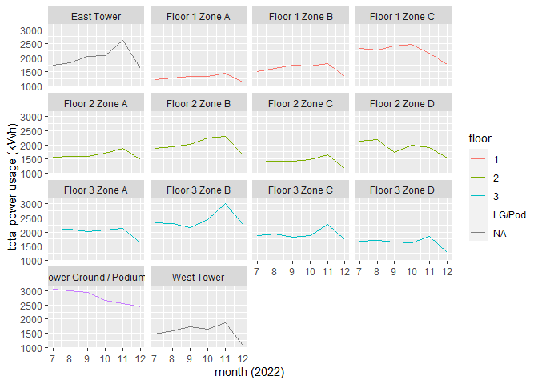
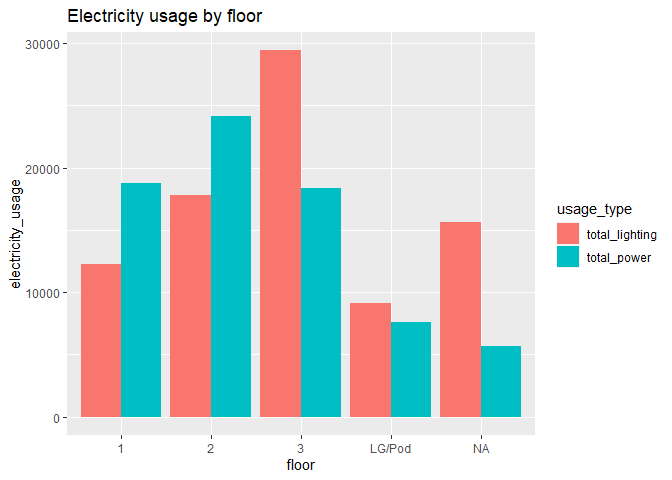

plot data
================
Lizzie Pearmain
May 2023

- <a href="#setup" id="toc-setup">setup</a>
- <a href="#usage-per-month-by-location"
  id="toc-usage-per-month-by-location">usage per month by location</a>
- <a href="#total-usage-by-floor" id="toc-total-usage-by-floor">total
  usage by floor</a>

## setup

Here we load any required packages, source functions, and read in
metadata.

``` r
## load packages
library(dplyr)
library(ggplot2)
library(tidyr)

## source functions
source("functions.R")

## read data
processed_meter_data <- read.csv("processed_meter_data.csv")
meter_metadata <- read.csv("meter_metadata.csv")
```

## usage per month by location

Just an example of summarising the data: group by floor and location,
and summarise total usage per month.

``` r
# head(df)

## sum over all meters in a floor/location by year and month
summ_floor_location_permonth <- processed_meter_data %>%
  dplyr::group_by(floor, location, year, month) %>%
  dplyr::summarise(total_usage = sum(both)) %>%   # both field = all lighting and power usage
  as.data.frame()
```

    ## `summarise()` has grouped output by 'floor', 'location', 'year'. You can
    ## override using the `.groups` argument.

``` r
head(summ_floor_location_permonth)  # check output
```

    ##   floor       location year month total_usage
    ## 1     1 Floor 1 Zone A 2022     7    1229.191
    ## 2     1 Floor 1 Zone A 2022     8    1289.043
    ## 3     1 Floor 1 Zone A 2022     9    1333.270
    ## 4     1 Floor 1 Zone A 2022    10    1343.344
    ## 5     1 Floor 1 Zone A 2022    11    1451.762
    ## 6     1 Floor 1 Zone A 2022    12    1146.363

Using the summary made above, we can plot a line graph of total monthly
usage, one graph per location.

``` r
## quick line graph of month usage data, split out by location field
plot_monthly <- ggplot2::ggplot(data = summ_floor_location_permonth, aes(x = month, y = total_usage, col = floor)) +
  ggplot2::geom_line() +  # specify we want lines
  ggplot2::labs(x = "month (2022)", y = "total power usage (kWh)") +  # change axis labels
  ggplot2::facet_wrap(~location)  # split out to one plot per location

## print out the plot
print(plot_monthly)
```

<!-- -->

``` r
## save to file as a .png
# help(ggsave)  # run this to check how the ggsave function works
ggplot2::ggsave(filename = "plots/monthly_usage_per_location.png", plot = plot_monthly)
```

    ## Saving 7 x 5 in image

## total usage by floor

``` r
## Summary tables
summary_by_floor <- processed_meter_data %>%
  dplyr::group_by(floor) %>%
  dplyr::summarise(total_power = sum(pwr, na.rm = TRUE), total_lighting = (sum(ltg, na.rm = TRUE)))

## Pivot table to have total_power and total_lighting as a column
summary_by_floor <- tidyr::pivot_longer(summary_by_floor, 
                                        cols = c("total_power", "total_lighting"), 
                                        names_to = "usage_type", 
                                        values_to = "electricity_usage")

## Plot
plot_by_floor <- ggplot2::ggplot(summary_by_floor, aes(fill = usage_type, y = electricity_usage, x = floor)) + 
  ggplot2::geom_bar(position="dodge", stat="identity") +  # position=dodge puts the bars for each group next to each other instead of on top of each other
  ggplot2::ggtitle("Electricity usage by floor")

## print out the plot
print(plot_by_floor)
```

<!-- -->

``` r
## save the plot to a file in the plots/ folder
ggplot2::ggsave(filename = "plots/total_usage_by_floor.png", plot = plot_by_floor)
```

    ## Saving 7 x 5 in image
